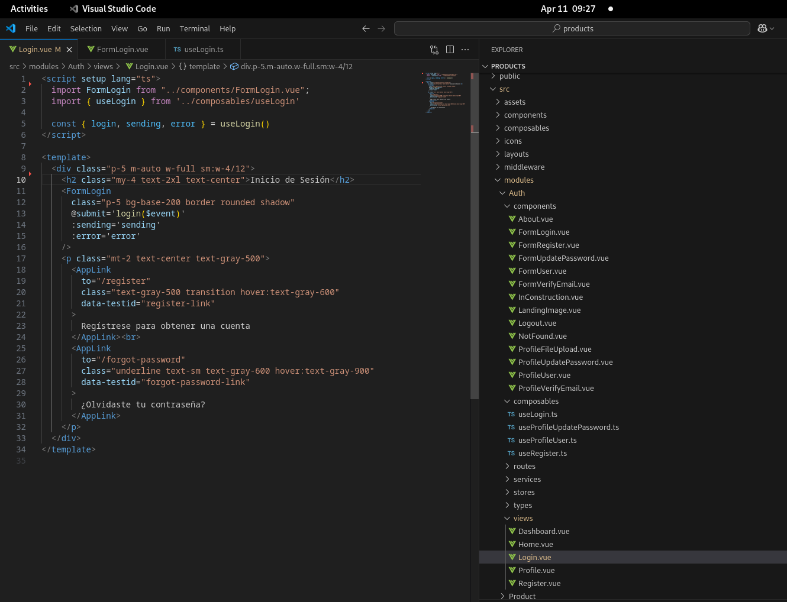
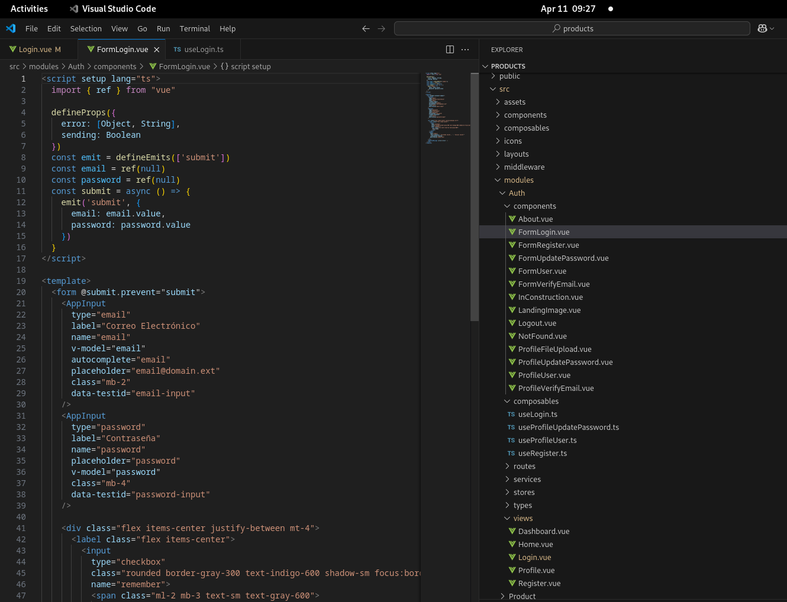
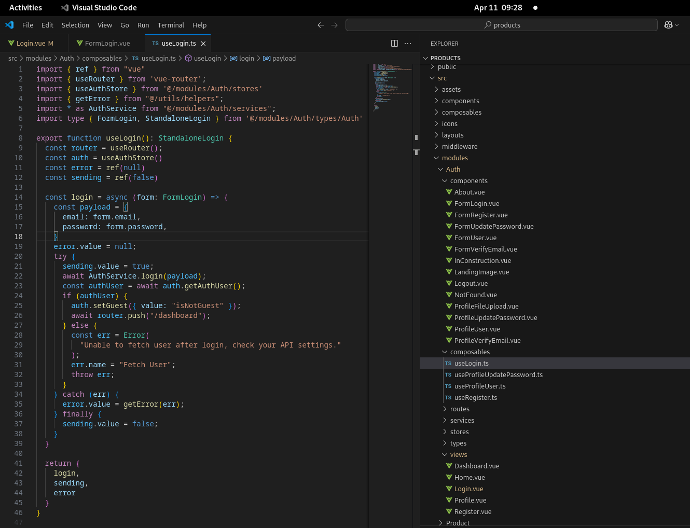

# El Problema

Suponiendo que vamos a revisar la página de **Iniciar Sesión** para depurar nuestro código. Entramos en la carpeta `src/modules/Auth/views/` y seleccionamos el archivo `Login.vue`.

Tenga en cuenta que `Login.vue` importa dos (2) archivos: el componente `LoginForm.vue` y el composable `useLogin.ts`, respectivamente.

Afortunadamente nuestro código ya está ordenado por módulos. En este caso, todo lo que necesitamos revisar está ubicado en el módulo `Auth`.

Tomando en cuenta que estos archivos no son reutilizables, nos preguntamos:

- Es suficiente agrupar los archivos por módulos y luego por el tipo de archivos? En este caso, para clasificarlos nos obliga a colocarle un prefijo (o sufijo) para relacionarlo con el correspondiente componente padre.
- En esta estructura de carpetas, prevalece el tipo de archivo por encima de la particular regla de negocio a la que concierne?
- Es necesario que estén tan separados entre ellos, `Login.vue`, `FormLogin` y `useLogin.ts`, respectivamente? Qué sucederá cuando la aplicación empiece a escalar con más archivos y más módulos?

A continuación, exploremos alternativas que pueden ser adoptadas para intentar lograr una estructura de carpetas más cómoda, flexible y escalable.

